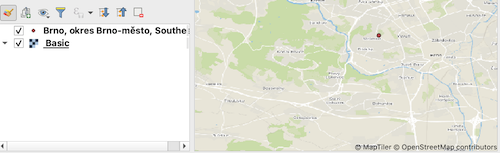

# qgis-maptiler-plugin
QGIS MapTiler Plugin: vector tiles, basemaps, geocoding, OSM, QuickMapServices

<!-- TOC -->

- [Instalation](#instalation)
- [Feature & Usage](#feature--usage)
    - [Access key](#access-key)
    - [Add maps to your project](#add-maps-to-your-project)
    - [Geocoding API](#geocoding-api)
- [For developer](#for-developer)

<!-- /TOC -->

## Instalation

There are two way to install this plugin.

1. QGIS Plugin Repository (unavailable yet)

2. From Zipfile of this repository

You have to re-launch QGIS application to complete instalation.
And then, MapTiler will be added to your QGIS Browser.

---

## Feature & Usage

### Access key

This plugin needs your access key of MapTiler cloud available for free.

### Add maps to your project

1. Preset

2. Usermap

### Geocoding API

Once install this plugin, MapTiler Toolbar for Geocoding API added to your QGIS.

Input a place you want to find and press return-key. MapTiler Geocoding API response list of locations.
When you click one of list, the mapcanvas move to it and Geometry added to your project.

  
 

---

## For developer

This repository is under Issue-based develop. If you have any idea or trouble, post a issue firstly.
We welcome all developers participating to improve this OSS project.
