# QGIS MapTiler Plugin

Simply add global base maps to QGIS. This plugin adds OpenStreetMap data from the OpenMapTiles project. Maps for this plugin are available from [MapTiler](https://www.maptiler.com/cloud/?utm_source=github.com&utm_medium=referral&utm_campaign=qgis-plugin). Customize the look and feel of maps or import GL JSON styles of TileJSON.

---

📖 [Documentation](https://docs.maptiler.com/guides/maps-apis/maps-platform/how-to-print-and-show-vector-tiles-in-qgis-via-maptiler-plugin/) &nbsp; 🌐 [Website](https://www.maptiler.com/qgis-plugin/?utm_source=github.com&utm_medium=referral&utm_campaign=qgis-plugin) &nbsp; 🔑 [Get API Key](https://cloud.maptiler.com/account/keys/)

---

 

 
<b>Table of Contents</b>

<ul>
<li><a href="#-installation">Installation</a></li>
<li><a href="#-basic-usage">Basic Usage</a></li>
<li><a href="#-reference">Reference</a></li>
<li><a href="#-support">Support</a></li>
<li><a href="#-contributing">Contributing</a></li>
<li><a href="#-license">License</a></li>
<li><a href="#-acknowledgements">Acknowledgements</a></li>
</ul>

   

 

## 📦 Installation

There are two ways to install this plugin.

1. From the official QGIS Plugin Repository - see the step-by-step guide at [https://www.maptiler.com/qgis-plugin/#install](https://www.maptiler.com/qgis-plugin/?utm_source=github.com&utm_medium=referral&utm_campaign=qgis-plugin#install)

2. From the [Zipfile](https://github.com/maptiler/qgis-maptiler-plugin/archive/master.zip) of this repository

If you do not see the MapTiler plugin in your QGIS Browser, try **re-launch the QGIS application**.
Then MapTiler should be added to your QGIS Browser.

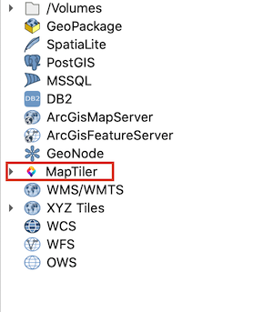

### Requirements

For plugin version 2.0, you need QGIS 3.16 or higher.

For plugin version 3.0, you need QGIS 3.24 or higher.

### Fonts

Maps from MapTiler use various fonts. You might get similar warnings in QGIS.

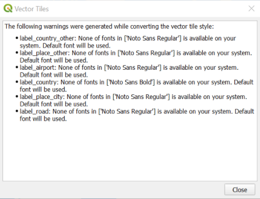

If you want to display these maps in QGIS, you need to have these fonts
installed on your system. QGIS will use a default font if the specific font is not installed on your system.

A list of fonts used in maps at MapTiler can be found at
[https://api.maptiler.com/fonts.json](https://api.maptiler.com/fonts.json).

 

## 🚀 Basic Usage

### Add background maps to a project

MapTiler plugin provides several preset maps. Some of them are visible from QGIS Browser. - Basic - Bright - OpenStreetMap - Outdoor - Satellite - Terrain - Toner - Topo - Voyager

More maps are available after you click on `Add a new map...` from MapTiler plugin contextual menu - on a tab `MapTiler Cloud`. You can choose from various maps available on MapTiler.

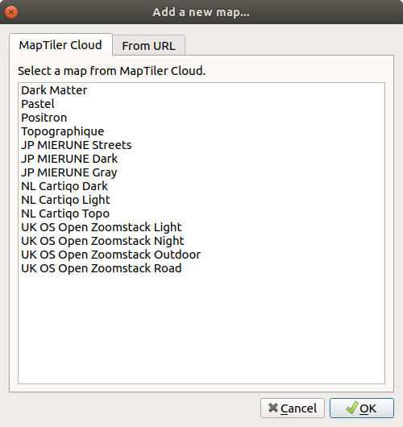

 

## 📘 Reference

For detailed guides, visit our comprehensive documentation:

[Documentation](https://docs.maptiler.com/guides/maps-apis/maps-platform/how-to-print-and-show-vector-tiles-in-qgis-via-maptiler-plugin/)

### Load a map in Mapbox GL JSON format

You can add your own map from the tab `From URL`. Add the name of your map and URL to JSON.

For **vector tiles**, you can add either URL to style.json or TileJSON. Note that if you add a URL to TileJSON, you will get only tiles data with basic QGIS styling. For **raster tiles**, you have to add a URL to TileJSON.

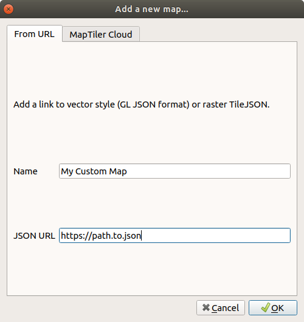

### Vector and raster tiles

MapTiler plugin supports loading maps via both vector and raster tiles. You can choose from the contextual menu of the map and click either on `Add as Raster` or `Add as Vector`.

You can choose the default type of tiles by checking/unchecking `Use vector tiles by default` in the Account dialog window.

Vector tiles support requires QGIS 3.13 or higher.
For the plugin version 2.0 and higher, you need QGIS 3.16 or higher.
For the plugin version 3.0 and higher, you need QGIS 3.24 or higher.

You can read about the difference between vector and raster tiles here [https://www.maptiler.com/news/2019/02/what-are-vector-tiles-and-why-you-should-care/](https://www.maptiler.com/news/2019/02/what-are-vector-tiles-and-why-you-should-care/?utm_source=github.com&utm_medium=referral&utm_campaign=qgis-plugin)

### Customize the look&feel of the base maps quickly

There is a possibility to simply adjust the default base maps in [Customize tool](https://www.maptiler.com/cloud/customize/?utm_source=github.com&utm_medium=referral&utm_campaign=qgis-plugin) - via a context menu on right-click in QGIS.

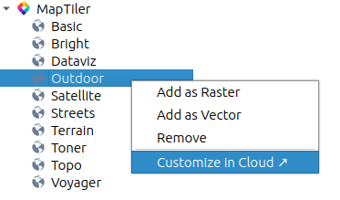

Switch language, select layers, and change colors to match your brand and make a perfect map.

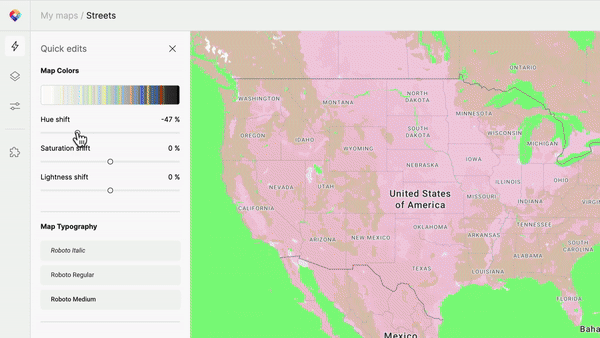

“Save” this map, and add it via URL - by copy&pasting the link to “GL JSON Style” from the Cloud page of the map.

### Global Digital Elevation Model (DEM)

The plugin offers the digital elevation model (DEM) of the entire planet.
You can use the layer for hillshading, hypsometry, analytical applications, and even 3D terrain modeling.

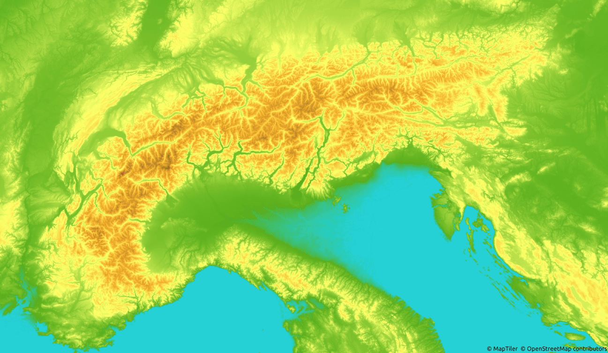

### Geocoding / place search

MapTiler plugin also provides MapTiler toolbar for basic geocoding / place search.

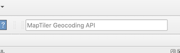

Input a place you want to find and press the return-key. MapTiler Geocoding API responds with a list of locations.
The map canvas will zoom to feature extent when you click on one place in the list.

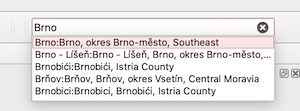

### Exporting/printing

You can export maps into high dpi PDFs, PNG or other formats. Benefit from high-detailed vector maps and
QGIS Print Layout Editor. Add common elements of a map layout, such as legend, title, scale, inset map or north arrow.

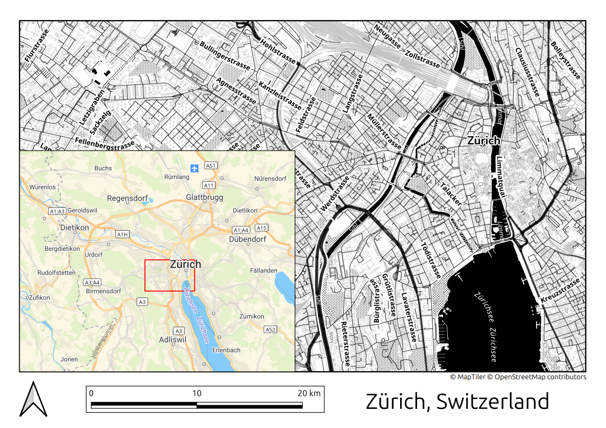

Please, be aware that printing/exporting map of large areas with high detail might cause big spikes in Cloud export
requests and might exceed your account limits.

Please, read [MapTiler Terms and Conditions](https://www.maptiler.com/terms/cloud/#LimitedPrints) to learn more
about permitted prints.

### Authentication

#### Credentials (for plugin version 3.0 and higher)

The plugin version 3.0 and higher uses credentials for authentication in MapTiler.
You can get your own FREE credentials at [https://cloud.maptiler.com/account/credentials](https://cloud.maptiler.com/account/credentials/?utm_source=qgis&utm_medium=product&utm_campaign=qgis-plugin)

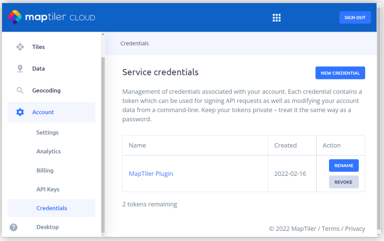

Click on `Account...` from MapTiler plugin contextual menu to open the Account dialog window and to insert your token.

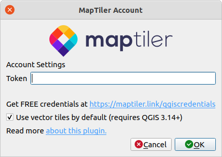

#### Access key (for older versions)

This plugin needs your access key from MapTiler that is available for free.
You can get your own FREE access key at [https://cloud.maptiler.com/account/keys](https://cloud.maptiler.com/account/keys?utm_source=github&utm_medium=product&utm_campaign=qgis-plugin)

Click on `Account...` from MapTiler plugin contextual menu to open the Account dialog window and to insert your access key.

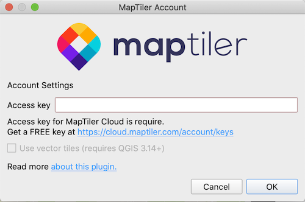

 

## 💬 Support

- 📚 [Documentation](https://docs.maptiler.com) - Comprehensive guides and API reference
- ✉️ [Contact us](https://maptiler.com/contact) - Get in touch or submit a request
- 🐦 [Twitter/X](https://twitter.com/maptiler) - Follow us for updates

 

---

 

## 🤝 Contributing

We love contributions from the community! Whether it's bug reports, feature requests, or pull requests, all contributions are welcome:

- Fork the repository and create your branch from `main`
- If you've added code, add tests that cover your changes
- Ensure your code follows our style guidelines
- Give your pull request a clear, descriptive summary
- Open a Pull Request with a comprehensive description
- If you have any ideas or trouble, please [post an Issue](https://github.com/maptiler/qgis-maptiler-plugin/issues) first.

This project is a community-driven open-source tool - please help us to make it better.

 

## 📄 License

This project is licensed under the GNU General Public License – see the [LICENSE](./LICENSE) file for details.

 

## 🙏 Acknowledgements

This project is built on the shoulders of giants:

- The plugin is maintained by the MapTiler team [www.maptiler.com](https://www.maptiler.com/?utm_source=github.com&utm_medium=referral&utm_campaign=qgis-plugin) - made with love in Switzerland and the Czech Republic.
- It has been co-developed together with [MIERUNE](https://mierune.co.jp/) in Japan.
- The native vector tiles python APIs in QGIS were developed by @wonder-sk from [Lutra](https://www.lutraconsulting.co.uk/crowdfunding/vectortile-qgis/)

 

 <a href="https://cloud.maptiler.com/account/keys/" style="display:inline-block;padding:12px 32px;background:#F2F6FF;color:#000;font-weight:bold;border-radius:6px;text-decoration:none;"> Get Your API Key FREE  Start building with 100,000 free map loads per month ・ No credit card required. </a> 

 

 💜 Made with love by the <a href="https://www.maptiler.com/">MapTiler</a> team  

  <a href="https://www.maptiler.com/qgis-plugin/">Website</a> •
  <a href="https://docs.maptiler.com/guides/maps-apis/maps-platform/how-to-print-and-show-vector-tiles-in-qgis-via-maptiler-plugin/">Documentation</a> •
  <a href="https://github.com/maptiler/maptiler-sdk-js/">GitHub</a>

