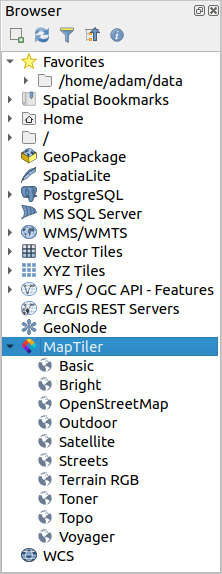

# qgis-maptiler-plugin
QGIS MapTiler Plugin: vector tiles, basemaps, geocoding, OSM, QuickMapServices

<!-- TOC -->

- [Instalation](#instalation)
- [Feature & Usage](#feature--usage)
    - [Access key](#access-key)
    - [Add maps to your project](#add-maps-to-your-project)
    - [Geocoding API](#geocoding-api)
- [For developer](#for-developer)

<!-- /TOC -->

## Instalation

There are two way to install this plugin.

1. QGIS Plugin Repository (unavailable yet)

2. From Zipfile of this repository

In case you do not see MapTiler plugin in your QGIS Browser try to re-launch QGIS application.
Then MapTiler should be added to your QGIS Browser.

---

## Feature & Usage

### Access key

This plugin needs your access key to MapTiler cloud that is available for free.
You can get your access key at https://cloud.maptiler.com/account/keys

Click on `Acount...` from MapTiler plugin contextual menu to open Account dialog window and to insert your access key.

### Vector vs raster tiles
You can read about difference between vector and raster tiles here: 
https://www.maptiler.com/news/2019/02/what-are-vector-tiles-and-why-you-should-care/

MapTiler plugin supports both vector and raster tiles. However support for vector tiles is available
only in QGIS 3.13 and higher. You can choose default type of tiles by checking/unchecking
`Use vector tiles by default` in Account dialog window.

### Add maps to your project

1. Preset

    MapTiler plugin provides several preset maps. Some of them are visible from QGIS Browser.
    - Basic
    - Bright
    - Satellite
    - Toner
    - Topo
    - Voyager
    
   More preset maps are available after clicking on `Add a new map...` from MapTiler plugin contextual menu
   on a tab `MapTiler Cloud`. You can choose from various maps provided on MapTiler cloud.
   
   

2. Usermap

    You can also add your own map from tab `From URL`. Add name of your map and URL to JSON.
    - For vector tiles you can add either URL to style.json or TileJSON. Note that if you add
    URL to TileJSON you will get only tiles data with basic QGIS styling.
    - For raster tiles you have to add URL to TileJSON.

    

### Geocoding API

MapTiler plugin also provides MapTiler Toolbar for Geocoding API.

Input a place you want to find and press return-key. MapTiler Geocoding API responds a list of locations.
When you click one of the list, map canvas will zoom to feature extent.

  

---

## For developer

This repository is under Issue-based develop. If you have any idea or trouble, post a issue firstly.
We welcome all developers participating to improve this OSS project.
