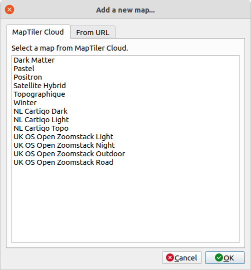

# QGIS MapTiler Plugin

Simply add global base maps to QGIS. This plugin adds OpenStreetMap data with OpenMapTiles project. Maps for this plugin are available from the MapTiler Cloud. Customize look and feel of maps or import GL JSON styles of TileJSON.

Homepage: https://maptiler.link/qgisplugin

<!-- TOC -->

- [Instalation](#instalation)
- [Feature & Usage](#feature--usage)
    - [Add background maps to a project](#add-background-maps-to-a-project)
    - [Vector and raster tiles](#vector-and-raster-tiles)
    - [Load a map in Mapbox GL JSON format](#load-a-map-in-mapbox-gl-json-format)
    - [Customize quickly the look&feel of the base maps ](#customize-quickly-the-lookfeel-of-the-base-maps)
    - [Geocoding / place search](#geocoding--place-search)
    - [Access key](#access-key)
- [For developer](#for-developer)

<!-- /TOC -->

## Instalation

There are two ways to install this plugin.

1. From official QGIS Plugin Repository - see step-by-step guide at https://maptiler.link/qgisplugin

2. From [Zipfile](https://github.com/maptiler/qgis-maptiler-plugin/archive/master.zip) of this repository

In case you do not see MapTiler plugin in your QGIS Browser try to **re-launch QGIS application**.
Then MapTiler should be added to your QGIS Browser.

---

## Feature & Usage

### Add background maps to a project

MapTiler plugin provides several preset maps. Some of them are visible from QGIS Browser.
    - Basic
    - Bright
    - Satellite
    - Toner
    - Topo
    - Voyager
    
More maps are available after you click on `Add a new map...` from MapTiler plugin contextual menu - on a tab `MapTiler Cloud`. You can choose from various maps provided on MapTiler cloud.
   

   
### Vector and raster tiles

MapTiler plugin supports loading maps via both vector and raster tiles.  You can choose from the contextual menu of the map and clicking either on `Add as Raster` or `Add as Vector`.

You can choose the default type of tiles by checking/unchecking `Use vector tiles by default` in the Account dialog window.

Vector tiles support requires QGIS 3.13 or higher.

You can read about the difference between vector and raster tiles here: 
https://www.maptiler.com/news/2019/02/what-are-vector-tiles-and-why-you-should-care/

 
### Load a map in Mapbox GL JSON format

You can also add your own map from the tab `From URL`. Add the name of your map and URL to JSON.

For **vector tiles** you can add either URL to style.json or TileJSON. Note that if you add URL to TileJSON you will get only tiles data with basic QGIS styling. For **raster tiles** you have to add URL to TileJSON.

### Customize quickly the look&feel of the base maps 

There is a possibility to simply adjust the default base maps in [Customize tool](https://maptiler.link/qgisstreets) - via a context menu on right-click in QGIS.

Switch language, select layers, and change colors to match your brand and make a perfect map.

“Save” this map, and add it via URL - by copy&pasting the link to “GL JSON Style” from the Cloud page of the map.

### Geocoding / place search

MapTiler plugin also provides MapTiler toolbar for basic geocoding / place search.

Input a place you want to find and press return-key. MapTiler Geocoding API responds with a list of locations.
When you click on one place in the list, the map canvas will zoom to feature extent.

  

### Access key

This plugin needs your access key to the MapTiler Cloud that is available for free.
You can get your own FREE access key at https://maptiler.link/qgiskeys

Click on `Account...` from MapTiler plugin contextual menu to open the Account dialog window and to insert your access key.

---

## Credits

The plugin is maintained by MapTiler team (https://www.maptiler.com/) - made with love in Switzerland and the Czech Republic.

It has been co-developed together with [MIERUNE](https://mierune.co.jp/) in Japan.
The native vector tiles python APIs in QGIS was developed by @wonder-sk from [Lutra](https://www.lutraconsulting.co.uk/crowdfunding/vectortile-qgis/)

## For developers

If you have any idea or trouble, please [post an Issue](https://github.com/maptiler/qgis-maptiler-plugin/issues) first.

We very much welcome contributions from all developers out there. This project is a community-driven open-source tool - please help us to make it better.

 
